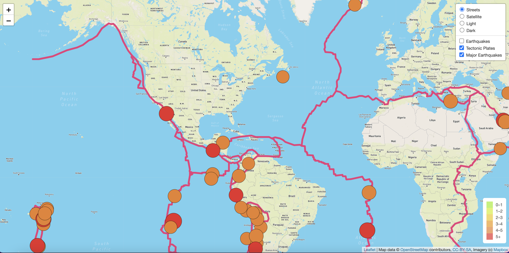

# Mapping_Earthquakes

###
The purpose of the repository is to display earthquakes around the globe over the past 7 days. Using Leaflet and GeoJSON, we have created multiple map background layers and layers to show earthquakes in the past 7 days, major earthquakes (over 4.5 mag), and tectonic plate lines. This layered map displays data showing where the earthquakes were and can be used to see what earthquakes and major earthquakes were along major fault lines.

